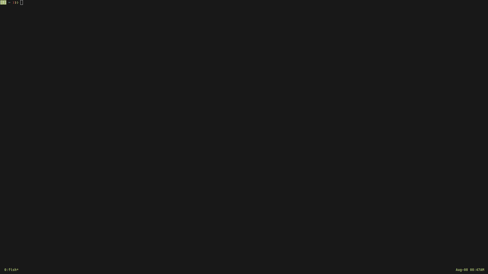
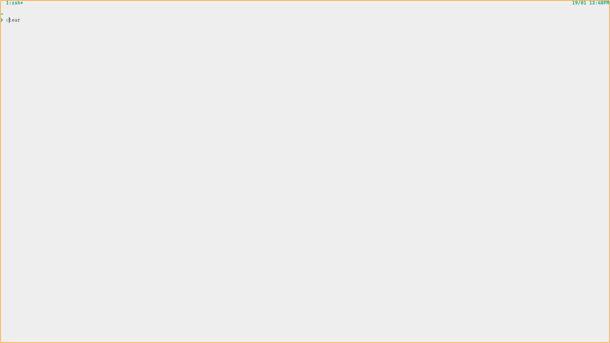

# Linux setup

- **DE support: Gnome**

## Demo

**You can watch my Talk show Oct 15, 2021: my setup for coding, daily use**

⇒ <https://youtu.be/2OhzSP1uGLc>



---

## Check list

**Note: you should edit script for your custom**

- [ ] Run step1 `./????step1`

  **Choise your script base your linux distro**

  > `./archStep1.sh` -- Arch base (pacman pkg) like manjaro, arco, artix,...--

  ```bash
  curl https://raw.githubusercontent.com/thuanpham2311/linux_setup/master/archStep1.sh | bash
  ```

  > `./ubuntuStep1.sh` -- Debian base (apt pkg) like ubuntu, popOS, mint,...--

  ```bash
  curl https://raw.githubusercontent.com/thuanpham2311/linux_setup/master/ubuntuStep1.sh | bash
  ```

  > `./fedoraStep1.sh` -- Using dnf pkg like fedora, RedHat, openSUSE,...--

  ```bash
  curl https://raw.githubusercontent.com/thuanpham2311/linux_setup/master/fedoraStep1.sh | bash
  ```

- [ ] Run step2 `./step2.sh`

  > this for everyone, **Note: your old file saved as ~/backupDotfile**

  ```bash
  curl https://raw.githubusercontent.com/thuanpham2311/linux_setup/master/step2.sh | bash
  ```

  > this for my personal, don't copy script below

  ```bash
  curl https://raw.githubusercontent.com/thuanpham2311/linux_setup/master/step2_personal.sh | bash
  ```

- [ ] **Edit file ~/.gitconfig** `nvim ~/.gitconfig` -by default: gitconfig using my email address-
