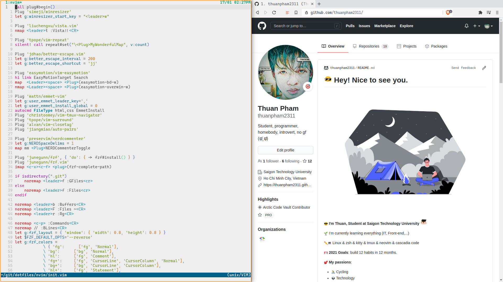
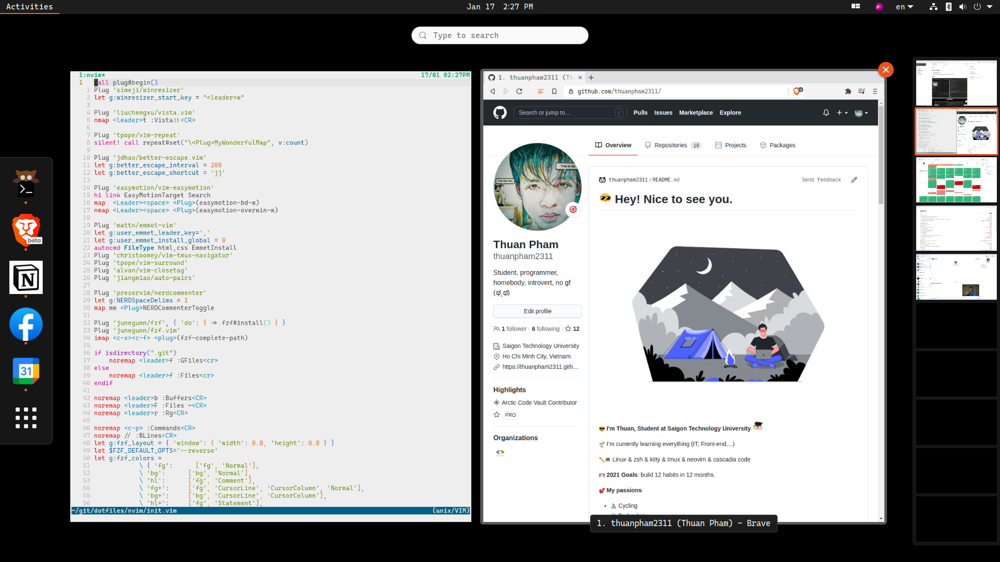

# Linux setup

- **DE support: Gnome**

- **All my commit message is BS, don't waste your time read that**

## Demo

### Dark


### Light




---

## Set up dudes

## install (just copy and pasting to your terminal)

```bash
sudo apt install git
git clone https://github.com/thuanpham2311/linux_setup
cd linux_setup
# ubuntu (or base Debian using apt)
./ubuntuStep1.sh
# fedora (or other distro using dnf)
# ./fedoraStep1.sh
# arch linux (or other arch base)
# ./archStep1.sh
```

---

## Stuff

1. pop shell

```bash
cd ~/.local/share/gnome-shell/extensions/
git clone https://github.com/pop-os/shell
cd shell
make local-install
```

2. hide top bar

```bash
cd ~/.local/share/gnome-shell/extensions/
git clone https://github.com/mlutfy/hidetopbar.git hidetopbar@mathieu.bidon.ca
cd hidetopbar@mathieu.bidon.ca
make schemas
cd ..
gnome-extensions enable hidetopbar@mathieu.bidon.ca
```

> ok let restart gnome run this: `gnome-shell --replace &`
> or just restart

3.  I don't like dock (For Ubuntu user, Fedora don't need do that)

`sudo apt remove gnome-shell-extension-ubuntu-dock`

4. `./step2.sh`

5. Edit file `~/.gitconfig` > change

   > code it for yourself

   > don't edit If want **my name and email** in your git system ;)

```bash
echo "
[user]
name = #your_name
email = #your_email
" > ~/.gitconfig
```

```bash
 ______
< DONE >
 ------
        \   ^__^
         \  (oo)\_______
            (__)\       )\/\
                ||----w |
                ||     ||
```

---

## freaking BUGS

1. Firefox tearing???????

`layers.acceleration.force-enabled` set it true and reboot

1. Fedora I have issue with Wayland so switch to Xorg

```
sudo nvim /etc/gdm/custom.conf

# should be
WaylandEnable=false
```

## Q & A

**Who am I?**

- I'm noob, just that
