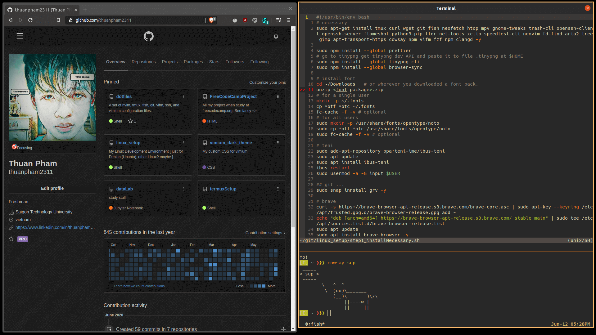
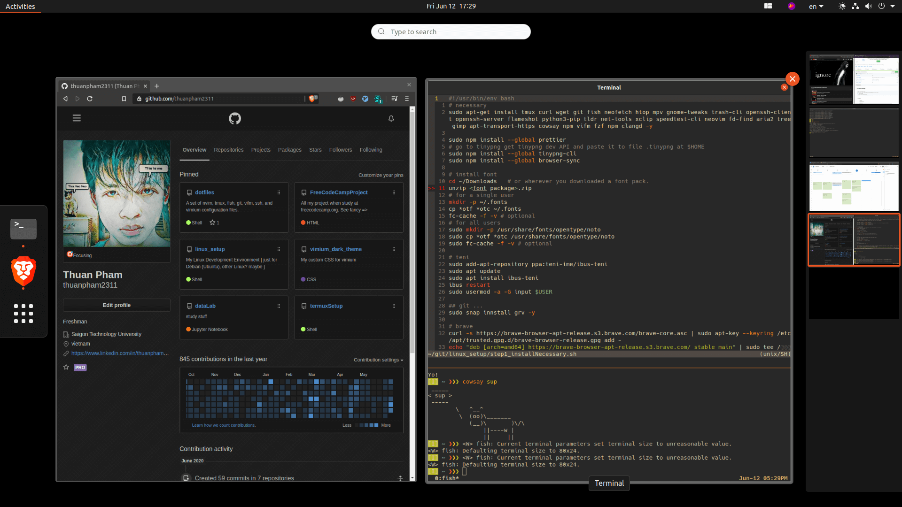

# Linux setup

**OS support: Ubuntu, Fedora**

## Demo




---

## Set up dudes

> **You don't need follow all this stuffs**

### Ubuntu

```bash
sudo apt install git
git clone https://github.com/thuanpham2311/linux_setup
cd linux_setup
./ubuntuStep1.sh
```

### Fedora

```bash
sudo apt install git
git clone https://github.com/thuanpham2311/linux_setup
cd linux_setup
./fedoraStep1.sh
```

---

1.  Setting

    1. Theme
    2. Background
    3. Shortcut
       1. Flameshot `flameshot gui`
       2. Switch to HDMI `pactl set-card-profile 0 output:hdmi-stereo`
       3. Switch to PC `pactl set-card-profile 0 output:analog-stereo`
    4. Language > input > Vietnamese > teni
    5. Time format > USA
    6. Power
    7. Privacy

2.  Gnome tweaks

    1. top bar > format stuff
    2. windows > center new windows

3.  Extension

    1. pop shell

    ```bash
    cd ~/.local/share/gnome-shell/extensions/
    git clone https://github.com/pop-os/shell
    cd shell
    sh rebuild.sh
    ```

    2. hide top bar

    ```bash
    cd ~/.local/share/gnome-shell/extensions/
    git clone https://github.com/mlutfy/hidetopbar.git hidetopbar@mathieu.bidon.ca
    cd hidetopbar@mathieu.bidon.ca
    make schemas
    cd ..
    gnome-extensions enable hidetopbar@mathieu.bidon.ca
    ```

    > ok let restart gnome run this: `gnome-shell --replace &`
    > or just restart

4.  I don't like dock (For Ubuntu user, Fedora don't need do that)

`sudo apt remove gnome-shell-extension-ubuntu-dock`

5.  update stuff

    1. Restart
    2. SSH key setup
       `ssh-keygen`

6.  Edit file `./step2_gitSetup` > change

    > code it for yourself

    > don't edit If want **my name and email** in your git system ;)

```bash
echo "
[user]
name = #your_name
email = #your_email
" > ~/.gitconfig
```

---

`./step2_gitSetup`

```bash
 ______
< DONE >
 ------
        \   ^__^
         \  (oo)\_______
            (__)\       )\/\
                ||----w |
                ||     ||
```

---

## freaking BUGS

1. Firefox tearing???????

`layers.acceleration.force-enabled` set it true and reboot

## Q & A

**Who am I?**

- I'm noob, just that

## Stargazers over time

[](https://starchart.cc/thuanpham2311/linux_setup)
